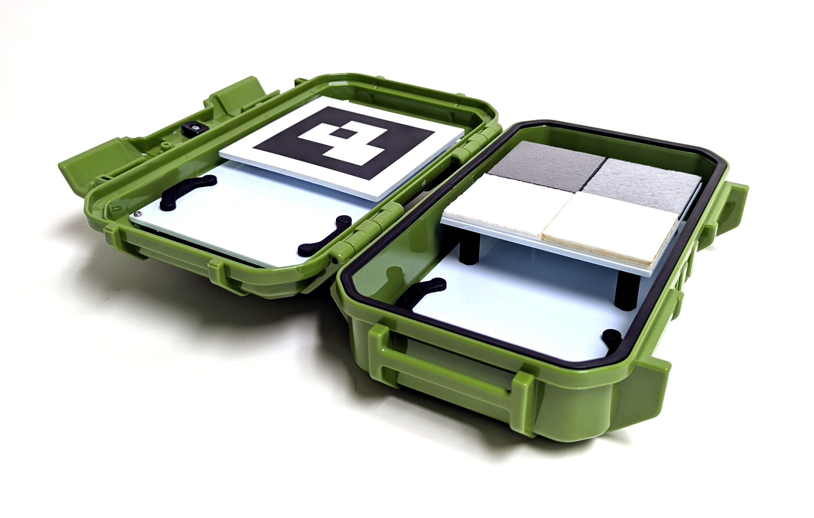

# Alvos de calibração

A MAPIR disponibiliza vários alvos de calibração para cobrir uma vasta gama de aplicações. O modelo compacto T4-R50, apresentado abaixo, contém 4 painéis cuja refletância da luz foi medida no intervalo de 250 a 2 500 nm.

<figure><figcaption>
MAPIR T4-R50
</figcaption></figure>Os alvos de referência difusos T4 apresentam as seguintes curvas de refletância, [descarregue os dados aqui](https://cdn.shopify.com/s/files/1/0972/5566/files/MAPIR_Diffuse_Reflectance_Standard_Calibration_Target_Data_T4.xlsx?v=1741759157):

<figure><figcaption>
MAPIR Refletância T4 :: 250-2 500 nm
</figcaption></figure>

<figure><figcaption>
MAPIR Refletância T4 :: 400-1 000 nm
</figcaption></figure>Os alvos de referência difusos T4P apresentam as seguintes curvas de refletância, [descarregue os dados aqui](https://cdn.shopify.com/s/files/1/0972/5566/files/MAPIR_Diffuse_Reflectance_Standard_Calibration_Target_Data_T4.xlsx?v=1741759157):

<figure><figcaption>
MAPIR Refletância T4P :: 250-2500 nm
</figcaption></figure>

<figure><figcaption>
MAPIR Refletância T4P :: 400-1000 nm
</figcaption></figure>Ao observar o gráfico de refletância, pode ver-se que os valores representam o comprimento de onda (eixo x) em função da percentagem de refletância (eixo y). Quando captamos uma imagem do alvo de calibração, estabelecemos uma relação entre o valor do pixel e a percentagem de refletância, dentro do espectro ao qual cada uma das bandas do sensor da câmara é sensível.

Isto significa que, em cada imagem captada com as nossas câmaras, pode utilizar uma fotografia dos nossos alvos de refletância, como o [T4-R50](https://www.mapir.camera/collections/calibration-targets/products/diffuse-reflectance-standard-calibration-target-package-t3-r50) ou [T4-R125](https://www.mapir.camera/collections/multispectral-reflectance-reference-calibration-targets/products/diffuse-reflectance-standard-calibration-target-package-t4-r125), para calibrar as imagens em termos de refletância. Uma vez calibrada, cada pixel da imagem corresponde a uma percentagem de refletância.

Para as **saídas do Survey3** , se exportar as imagens calibradas em Chloros como um ficheiro JPG típico ou em TIFF, a percentagem de refletância é calculada dividindo o valor do pixel pela profundidade de bits do formato da imagem. Assim, para JPG, divide-se por 255 e, para TIFF, divide-se por 65 535. Também pode optar pelo formato de saída PERCENT no Chloros; nesse caso, cada pixel terá um valor percentual compreendido entre 0,0 e 1,0 (0% a 100% de refletância). Tenha apenas em conta que algumas aplicações de imagem não aceitam imagens em percentagem (ponto flutuante) e que estas ocupam muito espaço de armazenamento.


**A refletância LATTICE utiliza uma escala de píxeis diferente.** A refletância LATTICE é armazenada com DN 32768 = 100% de refletância (e não 65535), e cada ficheiro contém uma etiqueta XMP `Chloros:PixelScale` que indica a sua escala. Leia a etiqueta e divida por esse valor, em vez de assumir uma constante — consulte [Formatos de imagem de saída](output-image-formats.md).


## Alvos de calibração com câmaras LATTICE

Com as câmaras LATTICE, um alvo de calibração é **opcional** para a refletância: o Chloros pode, em vez disso, referenciar a refletância à irradiância descendente medida por um sensor de luz DAQ (ρ = π·L/E). A referência é escolhida com a configuração da fonte de refletância (Definições do Projeto na GUI; `--reflectance-source` no CLI; `reflectance_source` no SDK):

| Valor | Comportamento |
| --- | --- |
| `auto` *(padrão)* | Um alvo dentro do quadro que passe no controlo de qualidade (QA) é a **referência absoluta**; quando não há nenhum alvo presente ou o QA falha, o Chloros recorre à divisão descendente do DAQ. |
| `target` | Apenas alvo estrito — sem substituição do DAQ. |
| `daq` | Autoridade do DAQ — a medição descendente é sempre a referência. |

Comportamento adicional do alvo para o LATTICE:

* **Geometrias do alvo** — São suportados painéis marcados com ArUco, painéis com ROI fixa e alvos em faixa; a geometria provém da configuração do alvo do projeto.
* **Dados de alvo medidos por unidade** — o `--target-reflectance-dir DIR` aponta para um diretório de varreduras de refletância de alvo medidas por unidade (`<serial>.csv`, consultadas pelo número de série/QR da unidade do alvo). Em caso de falha, o Chloros recorre aos espectros nominais T3/T4P.
* **Ancoragem temporal** — um alvo detetado calibra os fotogramas à sua volta e é mantido entre os avistamentos do alvo.

A semântica completa dos sinalizadores e os exemplos encontram-se na [Referência do CLI](reference/cli-reference.md) (ver «Opções de exportação por produto»).

### F988

«A refletância do F988 é calibrada utilizando um painel de refletância na cena: a banda situa-se para além da gama calibrada do sensor de luz do DAQ, pelo que o Chloros aplica a sua captura mais recente do painel e mantém-na entre as observações do painel.»

Se o F988 for executado com calibração apenas pelo DAQ, o Chloros rejeita a refletância baseada no DAQ para essa banda e indica o motivo (motivo de omissão `dls-uncalibrated-band-988`); o fluxo de trabalho com o painel é o caminho suportado.

<figure><figcaption>
T4-R125
</figcaption></figure> <figure><figcaption>
T4-R125
</figcaption></figure> <figure><figcaption>
T4-R125
</figcaption></figure>

